# ATU Hostel Booking Management System (HBMS)

All diagrams below are **Mermaid**. They render in GitHub, VS Code (Markdown preview), Notion, and many slide tools. Copy any fenced `mermaid` block as needed.

---

## 1. System architecture (three layers)

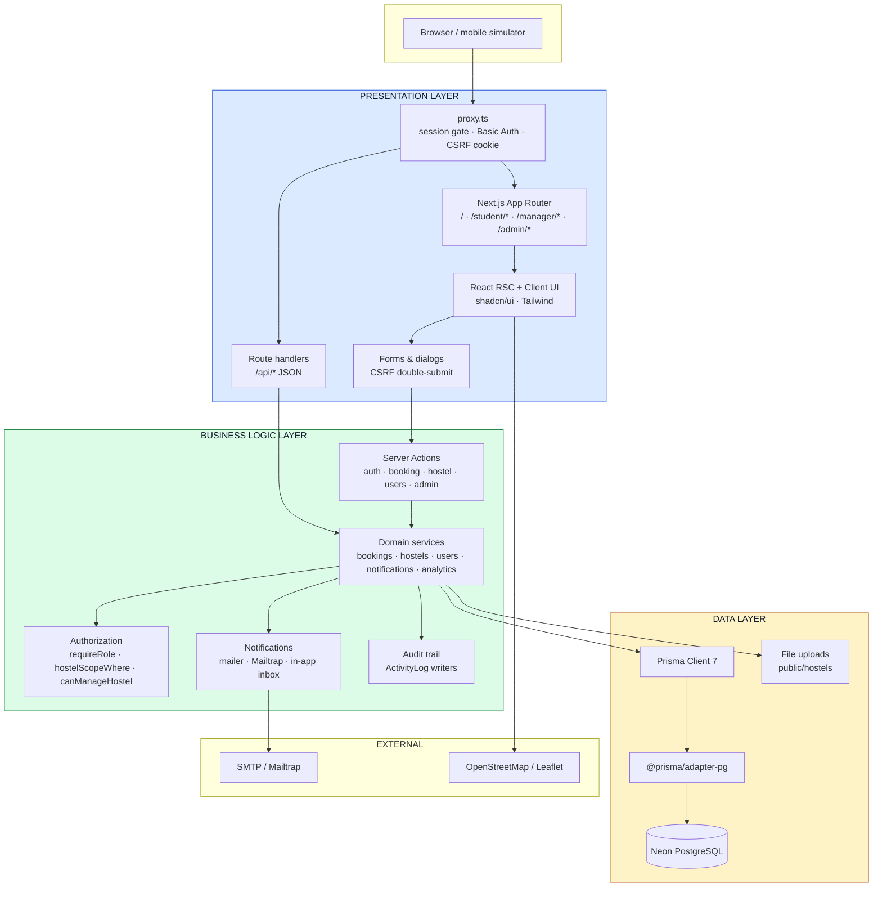

### Layer map

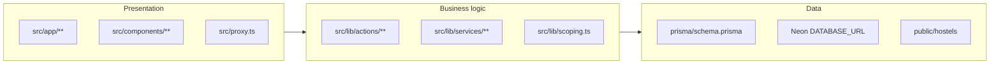

### Request flow

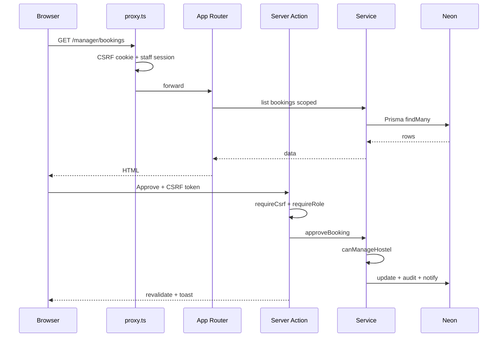

### Role URL prefixes

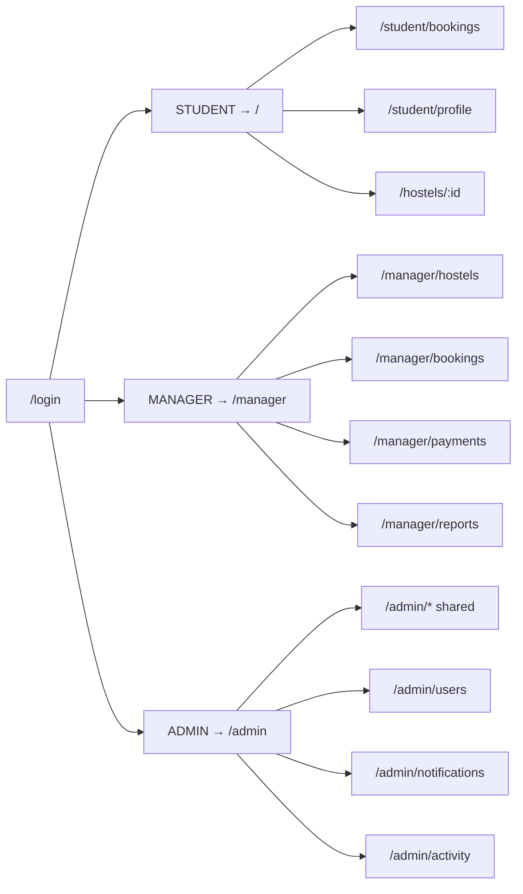

---

## 2. Database ER diagram

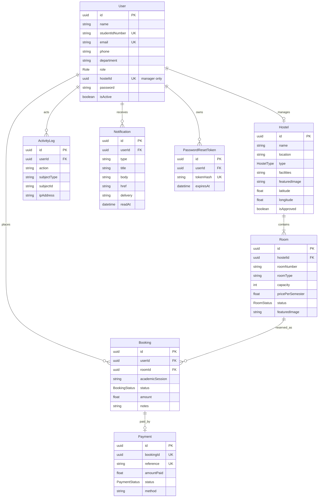

### Enums

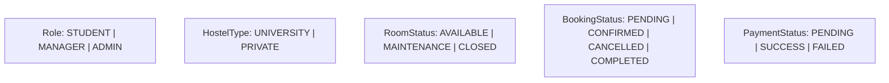

---

## 3. UI wireframes (Mermaid)

### Student catalog (`/`)

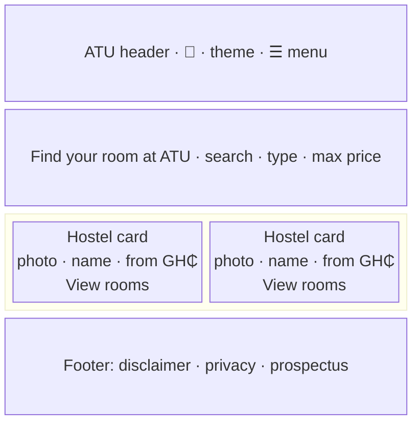

### Student bookings (`/student/bookings`)

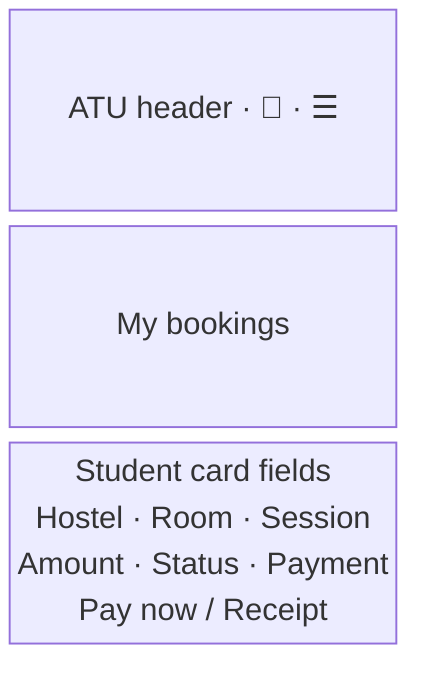

### Manager dashboard (`/manager`)

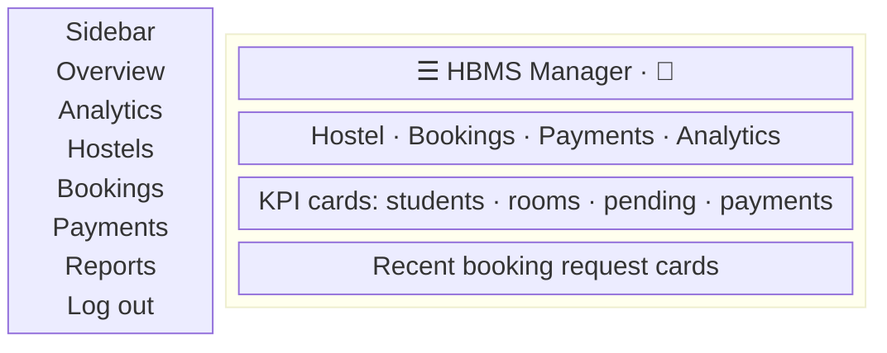

### Manager bookings (`/manager/bookings`)

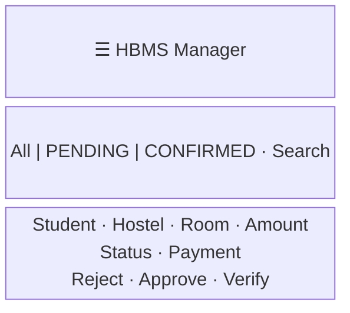

### Admin users (`/admin/users`)

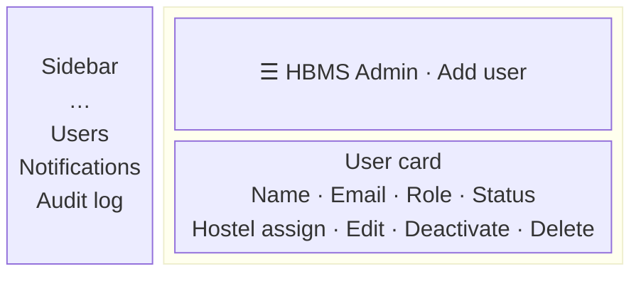

### Role navigation flow

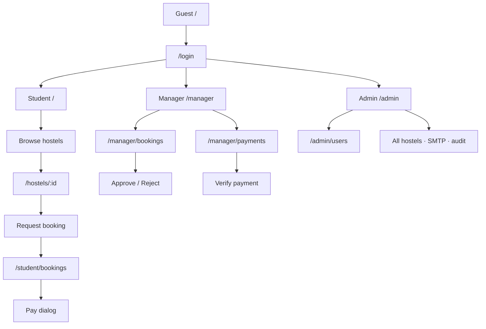

---

## 4. Security architecture

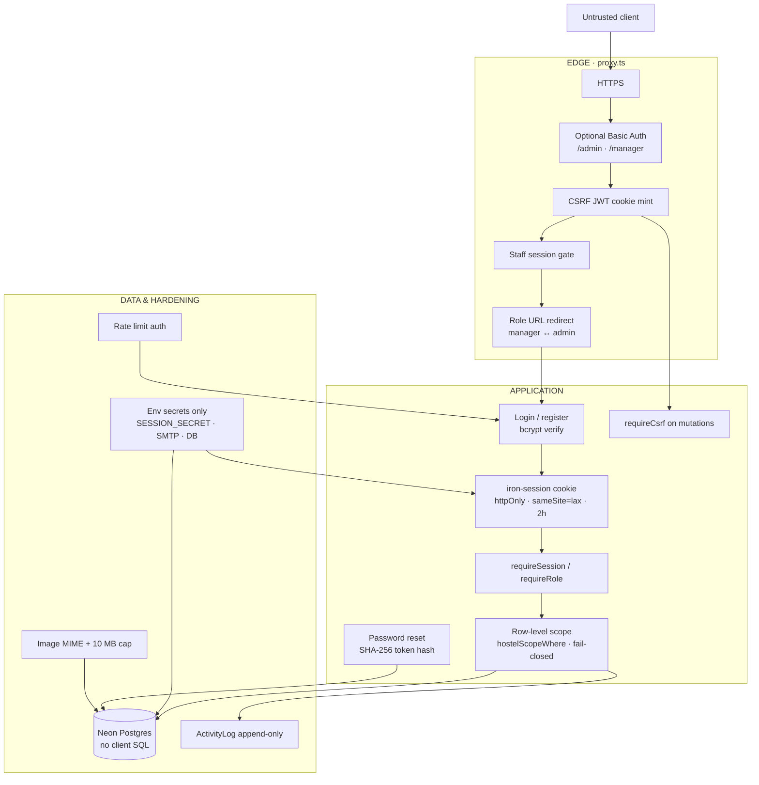

### Controls matrix (Mermaid)

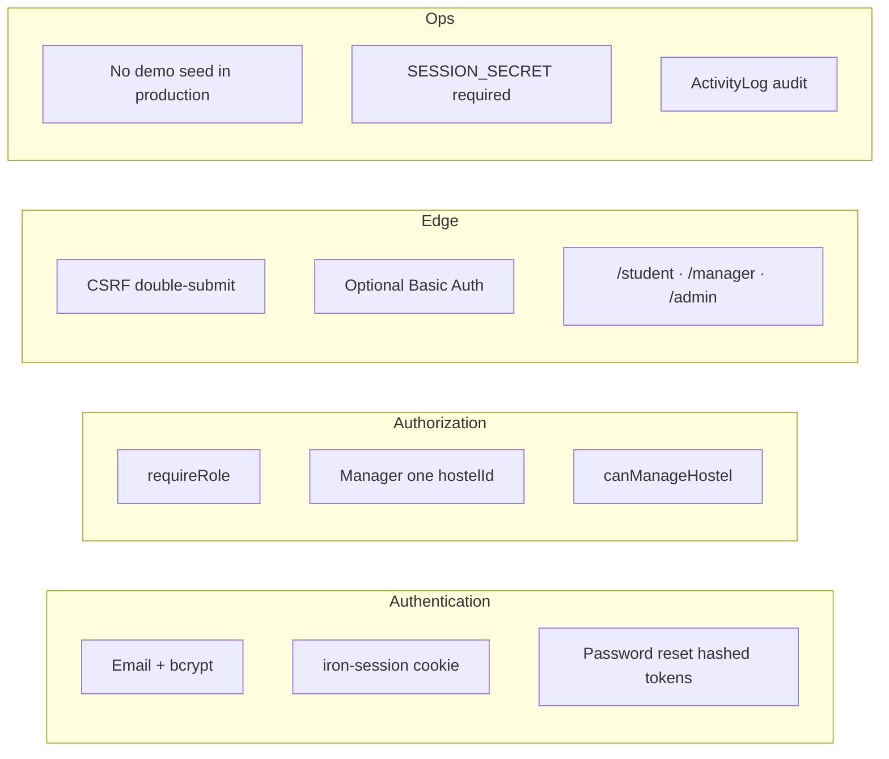

### Trust boundaries

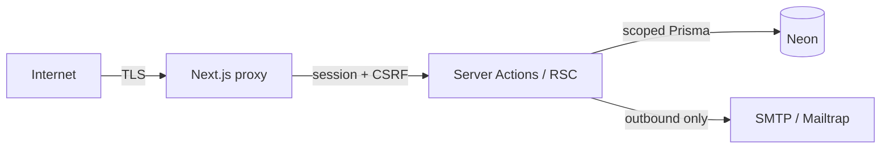

---

## How to use

1. Open this file in VS Code and use Markdown preview (Mermaid usually works with the built-in or a Mermaid extension).
2. Paste any ` ```mermaid ` block into [mermaid.live](https://mermaid.live) to export PNG/SVG for slides.
3. GitHub renders these blocks automatically on the repo page.
